# h2 | Aleksis Rautiainen

## Sisällysluettelo

- [h2 | Aleksis Rautiainen](#h2--aleksis-rautiainen)
  - [Sisällysluettelo](#sisällysluettelo)
  - [Tehtävät](#tehtävät)
    - [z) Lue ja tiivistä](#z-lue-ja-tiivistä)
      - [Karvinen 2020: Command Line Basics Revisited](#karvinen-2020-command-line-basics-revisited)
    - [a) FHS. Esittele kansiot.](#a-fhs-esittele-kansiot)
    - [b) My CLI](#b-my-cli)
    - [c) Tukki. Aiheuta lokiin kaksi eri tapahtumaa.](#c-tukki-aiheuta-lokiin-kaksi-eri-tapahtumaa)
    - [d) The Friendly M. Näytä 2-3 kuvaavaa esimerkkiä grep-komennon käytöstä.](#d-the-friendly-m-näytä-2-3-kuvaavaa-esimerkkiä-grep-komennon-käytöstä)
    - [e) Pwnkit. Päivitä kaikki Linux-ohjelmat ja asenna tietoturvapäivitykset.](#e-pwnkit-päivitä-kaikki-linux-ohjelmat-ja-asenna-tietoturvapäivitykset)
- [Lähteet](#lähteet)

## Tehtävät

### z) Lue ja tiivistä

#### Karvinen 2020: Command Line Basics Revisited

- Linuxissa ja BSD:ssä käytettävä komentorivi on ollut olemassa jo ennen Googlea, Nettiä, Linuxia, Windowsia ja jopa Internettiä. Se on nopea, helppokäyttöinen, helppo automatisoida ja monella jokapäiväisessä käytössä
- Tiedostojen tutkiminen ja niissä liikkuminen tapahtuu helposti muutamalla komennolla. Pwd printtaa työhakemiston, ls listaa tiedostot hakemistossa, cd komento on liikkumiseen ja sen perään laitetaan kohde, less komento näyttää tekstitiedosto.
- Helpoimmat tekstieditorit ovat Pico ja Nano.
- Ainoastaa korkeat etuoikeudet vaativat operaatiot ajetaan sudo -komennolla.
- sudo apt-get on tärkeä ohjelmien asentamiseen liittyvä komento.

### a) FHS. Esittele kansiot.

Aluksi avasin Linuxissa terminaalin ja aloin selaamaan tärkeitä hakemistoja

#### Juurihakemisto

Ensimmäisenä aloitin ensimmäisestä hakemistosta eli juurihakemistosta. Otin ensin komennolla pwd selvää missä olen sillä hetkellä ja sitten komennolla cd .. menin kaksi kertaa taaksepäin kunnes olin juurihakemistossa. Sillä ei ole Linuxissa mitään nimeä, joten pwd komennolla tulee vain / . Tämän jälkeen listasin juurihakemiston sisällön.

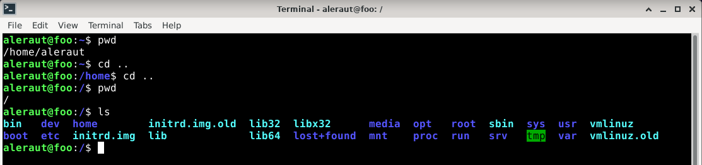

#### /home/aleraut

Seuraavaksi menin cd home -komennolla kotihakemistoihin, ja siellä pwd komento antoi /home. Komennolla ls listasin home-hakemiston sisällön, jossa ei ollut muuta kuin aleraut, eli oma käyttäjäni.

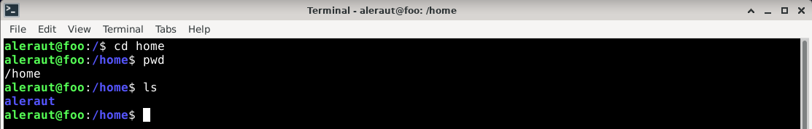

Siirryin cd aleraut -komennolla oman käyttäjäni hakemistoon. Pwd -komento antoi /home/aleraut, ja ls komento listasi käyttäjähakemiston sisällön, johon kuuluu monia hakemistoja, kuten Desktop, Documents, Downloads yms. . Sen sisällä on myös muutama treeni-kansio jotka olen tehnyt tunnilla.

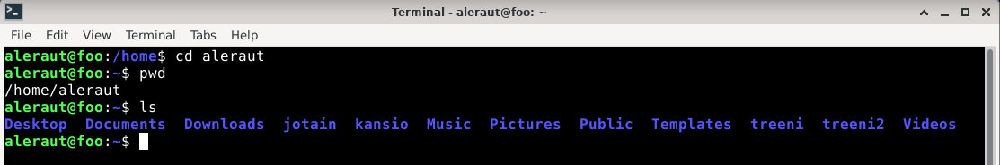

#### /etc

Etc hakemiston muistin nähneeni juurihakemiston listauksessa, joten siirryin cd -komennolla juurihakemistoon ja listasin sisällön. Siellä näkyi etc hakemisto joten siirryin siihen cd etc -komennolla. etc-hakemistossa pwd antoi /etc, ja ls listasi erittäin monta tiedostoa ja hakemistoa, joista melkein kaikki on minulle tuntemattomia. Listauksessa silmään pisti asiat kuten passwd-tiedosto ja kansio security.

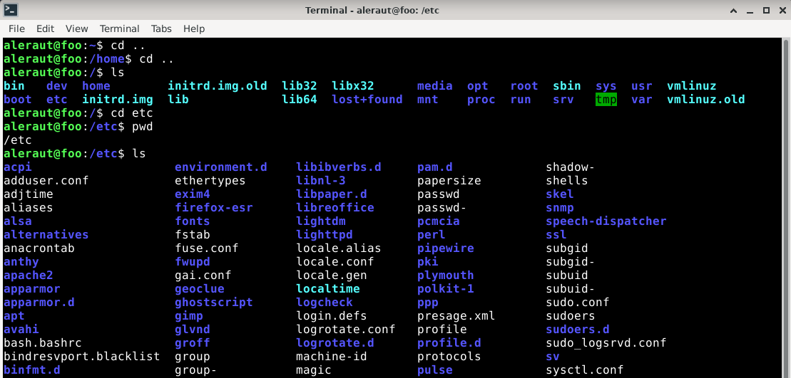

#### /media

Media -hakemisto löytyi myös juurihakemistosta. Media -hakemiston pwd antoi /media, ja ls listasi vain aleraut -hakemiston. Mielenkiinnosta menin aleraut hakemistoon /media/aleraut, mutta sen listaus ei antanut mitään.

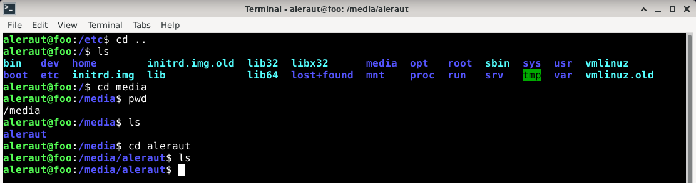

#### /var/log/

Var -hakemisto löytyi taas juurihakemistosta, ja sen sisällä oli listauksessa log -hakemisto, joten suuntasin sinne. Log -hakemiston sisällä pwd antoi /var/log niinkuin pitikin, ja ls listasi taas monta hakemistoa ja monia .log tiedostoja.

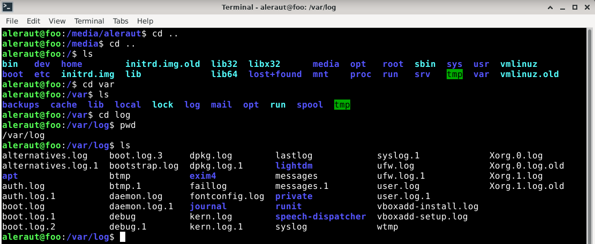

### b) My CLI

#### TLDR

Ensimmäisenä ohjelmana asensin TLDR-nimisen työkalun, jolla voin komentorivillä pitkien man-sivujen sijaan tldr -komennolla saada lyhyen selityksen ja tärkeimpänä esimerkkejä komennoista.

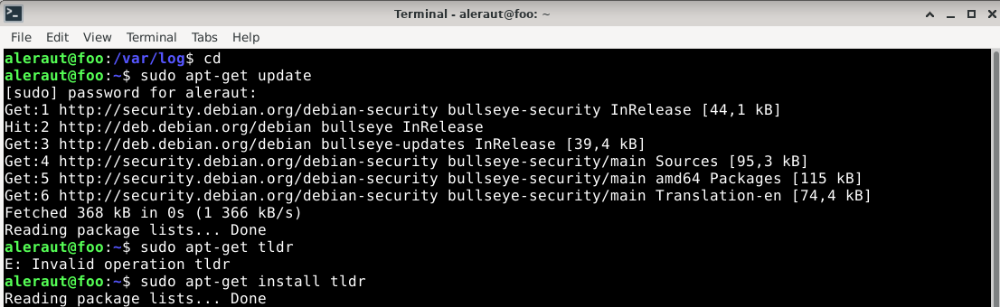

En saanut tldr toimimaan vaikka yritin ladata nodea ohjeiden mukaan avuksi.

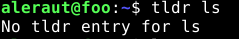

#### Googler

Googlerin avulla voin hakea googlesta asioita suoraan komentoriviltä.

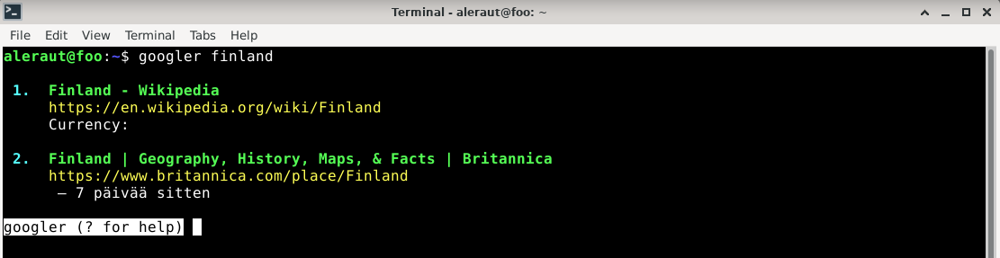

#### CMatrix

Viimeisenä ohjelmana asensin komentoriville CMatrix ohjelman, joka on oikeastaan vitsinä toimiva ohjelma. Se tekee komentoriville Matrix-elokuvista tutun näköisen näkymän. Ihan siisti omasta mielestä.

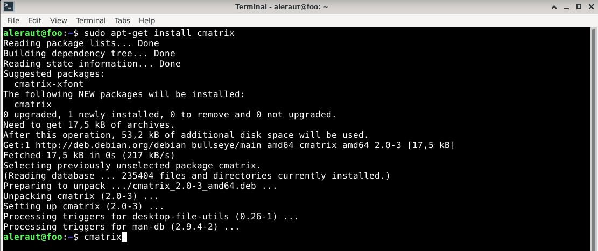

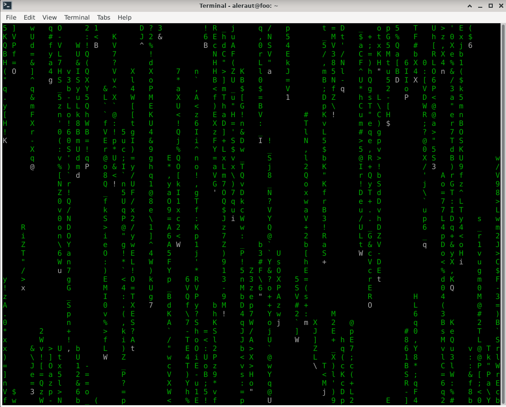

### c) Tukki. Aiheuta lokiin kaksi eri tapahtumaa.

#### Epäonnistunut

Yritin seurata daemon.log tapahtumia, mutta se ilmoitti "permission denied".

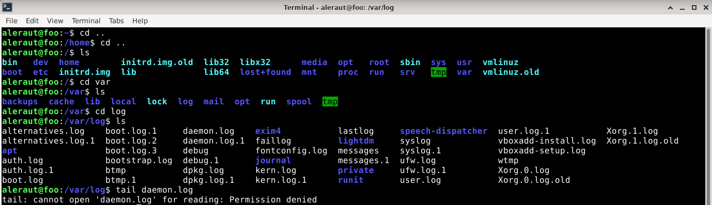

#### Onnistunut

Sain seurattua user.log tapahtua sudo -komennon avulla. En saanut lokitapahtumaan kuitenkaan mitään muutosta.

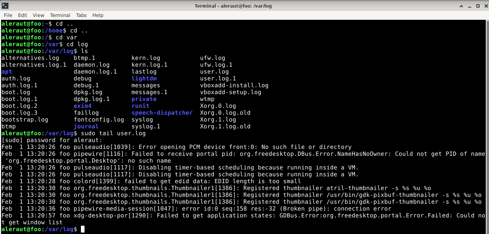

### d) The Friendly M. Näytä 2-3 kuvaavaa esimerkkiä grep-komennon käytöstä.

Man grep avasi grepin manuaalin.

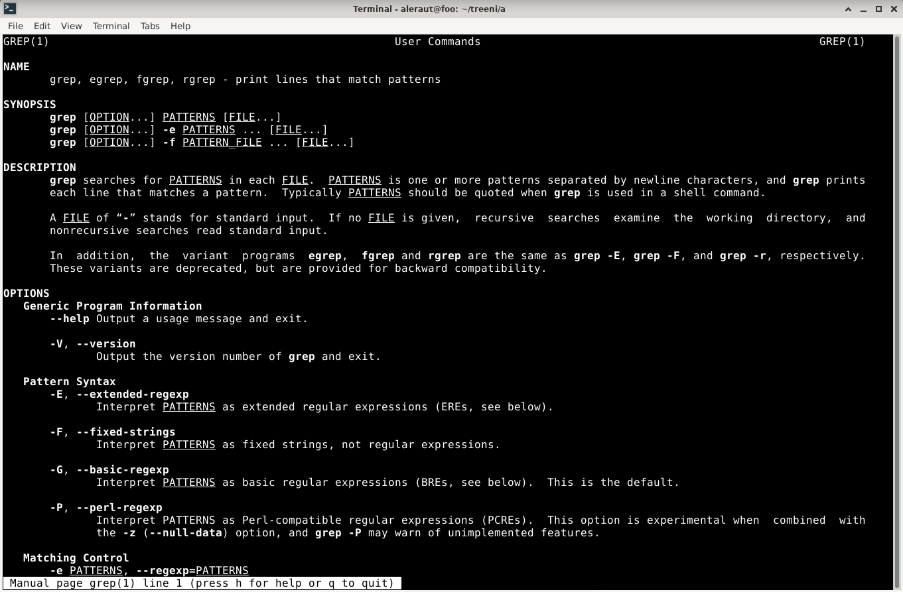

Grepin version sai tietää siis komennolla grep -V.

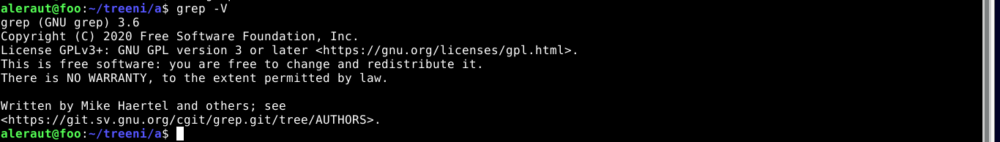

Grepin avulla sain esimerkiksi tiedostosta haettua hakusanalla tietyn rivin tekstiä.

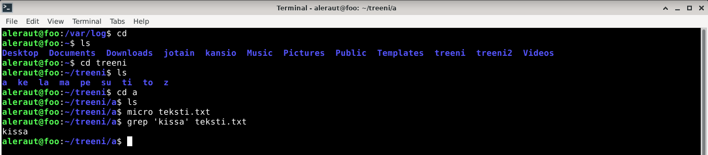

### e) Pwnkit. Päivitä kaikki Linux-ohjelmat ja asenna tietoturvapäivitykset.

Päivitin Linux ohjelmat ja asensin tietoturvapäivitykset komennoilla sudo apt-get update ja sudo apt-get upgrade.

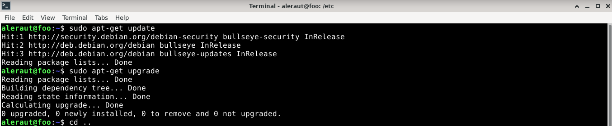

## Lähteet

terokarvinen.com tehtävänanto - [h2](https://terokarvinen.com/2021/linux-palvelimet-ict4tn021-3018/#h2)

[Karvinen 2020: Command Line Basics Revisited](https://terokarvinen.com/2020/command-line-basics-revisited/)
