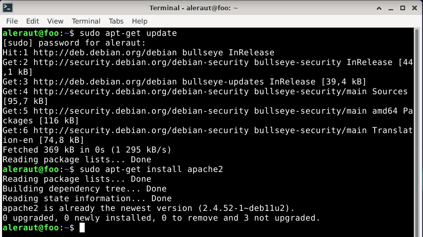
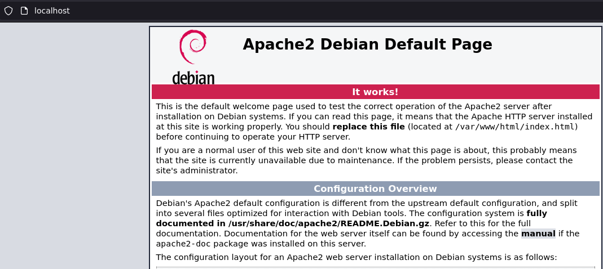
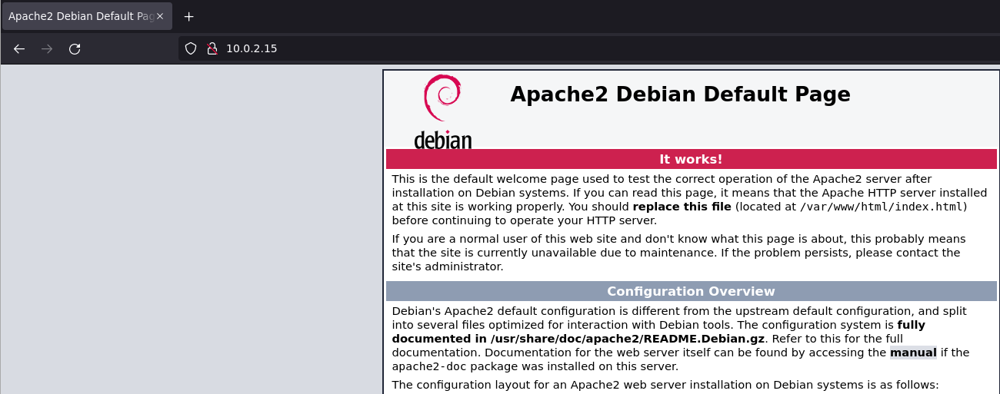
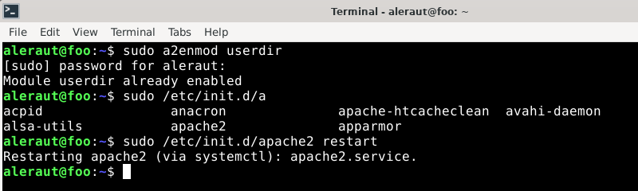
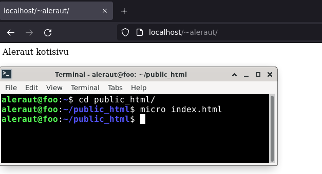
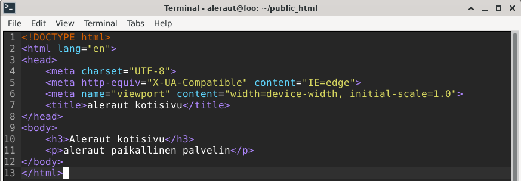
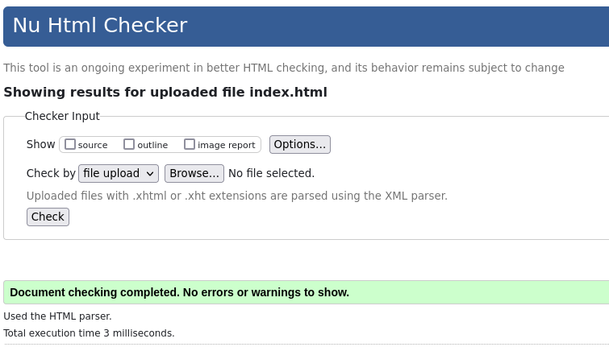

# h3 | Aleksis Rautiainen

## Sisällysluettelo

- [h3 | Aleksis Rautiainen](#h3--aleksis-rautiainen)
  - [Sisällysluettelo](#sisällysluettelo)
  - [Tehtävät](#tehtävät)
    - [a) Asenna Apache](#a-asenna-apache)
    - [b) Laita käyttäjien kotisivut toimimaan](#b-laita-käyttäjien-kotisivut-toimimaan)
    - [c) Tee validi HTML5 sivu](#c-tee-validi-html5-sivu)
    - [d) Surffaa oman palvelimesi weppisivuja](#d-surffaa-oman-palvelimesi-weppisivuja)
    - [e) Vaihda Apachen esimerkkisivu johonkin lyhyeen sivuun](#e-vaihda-apachen-esimerkkisivu-johonkin-lyhyeen-sivuun)
- [Lähteet](#lähteet)

## Tehtävät

### a) Asenna Apache

Ensimmäisenä päivitin pakettilistan komennolla sudo apt-get update, jonka jälkeen asensin apachen komennolla sudo apt-get install apache2.

Testasin apachen toiminnan ohjeen mukaan. Ensimmäisenä menin selaimessa osoitteeseen "http://localhost", jossa esiin tuli apachen esimerkkisivu. Sivulla lukee "It works", joten oletan apachen toimivan.

Apache-palvelimeni ip-osoitteen sain Terminaalista komennolla "ip addr". IP osoitteen sai kohdasta inet, ja se oli 10.0.2.15 .

Selaimessa menin osoitteeseen "http://10.0.2.15", jossa aukesi sama sivu kuin localhostilla.

### b) Laita käyttäjien kotisivut toimimaan

Ensin piti sallia käyttäjän kotihakemisto komennolla "sudo a2enmod userdir", ja käynnistää sen jälkeen apache uudelleen komennolla "sudo /etc/init.d/apache2 restart".

Seuraavaksi tein kotihakemistoon kansion "public_html" komennolla "mkdir public_html". Komennolla "whoami", sain käyttäjänimeni "aleraut", jonka avulla sain samalla koneella yhteyden paikalliselle palvelimelle "http://localhost/~aleraut/".

### c) Tee validi HTML5 sivu

Seuraavaksi tein validin html5 sivun paikalliselle palvelimelle. Kotihakemistossani komennolla "ls", näin kansiot sen sisällä. menin juuri tekemääni public_html kansioon komennolla "cd public_html/". Sen sisällä loin index.html tiedoston komennolla "micro index.html", ja pääsin suoraan muokkaamaan sitä. Kirjotin sinne vain "Aleraut kotisivu". Päivitettyäni sivun selaimessa teksti ilmestyi ruudulle.

HTML-sivun piti olla validi, joten muokkasin html-tiedostoa "micro" komennolla, ja laitoin tiedoston validointi-nettisivulle.

### d) Surffaa oman palvelimesi weppisivuja

### e) Vaihda Apachen esimerkkisivu johonkin lyhyeen sivuun

## Lähteet

terokarvinen.com tehtävänanto - [h3](https://terokarvinen.com/2021/linux-palvelimet-ict4tn021-3018/#h3)

[Install Apache Web Server on Ubuntu](https://terokarvinen.com/2008/install-apache-web-server-on-ubuntu-4/)

[Instant Firewall – sudo ufw enable](https://terokarvinen.com/2016/instant-firewall-sudo-ufw-enable/)
