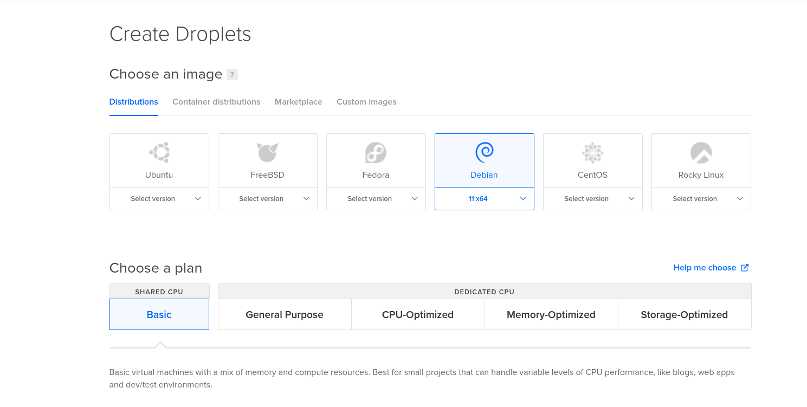
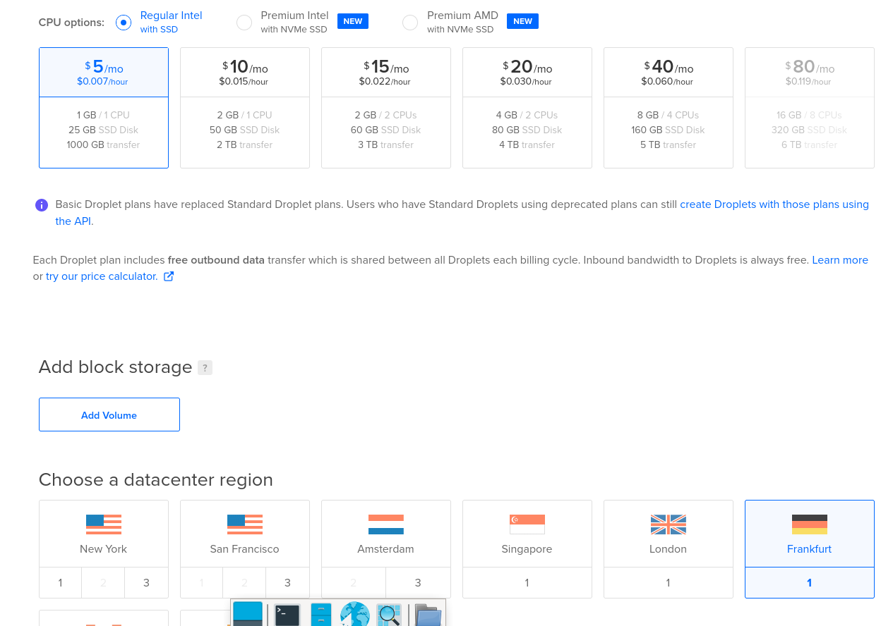

# h4 | Aleksis Rautiainen

## Sisällysluettelo

- [h4 | Aleksis Rautiainen](#h4--aleksis-rautiainen)
  - [Sisällysluettelo](#sisällysluettelo)
  - [Tehtävät](#tehtävät)
    - [z) Lue ja tiivistä](#z-lue-ja-tiivistä)
      - [Karvinen 2017: First steps on a New Virtual Private Server](#karvinen-2017-first-steps-on-a-new-virtual-private-server)
      - [Karvinen 2018: Name Based Virtual Hosts on Apache](#karvinen-2018-name-based-virtual-hosts-on-apache)
    - [a) Vuokraa ja asenna oma julkinen palvelin Internettiin](#a-vuokraa-ja-asenna-oma-julkinen-palvelin-internettiin)
    - [d) Suojaa palvelin tulimuurilla](#d-suojaa-palvelin-tulimuurilla)
    - [e) Laita koneellesi Apache weppipalvelin](#e-laita-koneellesi-apache-weppipalvelin)
    - [f) Päivitä palvelimesi kaikki ohjelmat](#f-päivitä-palvelimesi-kaikki-ohjelmat)
    - [g) Etsi lokeistasi merkkejä murtautumisyrityksistä ja analysoi ne](#g-etsi-lokeistasi-merkkejä-murtautumisyrityksistä-ja-analysoi-ne)
- [Lähteet](#lähteet)

## Tehtävät

### z) Lue ja tiivistä

#### Karvinen 2017: First steps on a New Virtual Private Server

- Ohje virtuaalisen yksityisen palvelimen konfiguroimiseen
- Ensin pitää tehdä uusi virtuaalinen palvelin DigitalOceanissa, ja asettaa palomuuri jossa on kulkureitti
- Asenna sudolla käyttäjäoikeudet
- Sulje root käyttäjä, päivitä softa ja aloita käyttö

#### Karvinen 2018: Name Based Virtual Hosts on Apache

- Apachen avulla on mahdollista olla monta eri domainia samalla IP-osoitteella
- Lataa ja konfiguroi webbi palvelin
- Lisää sudoeditillä uusi nimipohjainen virtuaalihosti
- Luo weppisivu normaalina käyttäjänä ja testaa

### a) Vuokraa ja asenna oma julkinen palvelin Internettiin

Ensin menin [DigitalOcean.comiin](digitalocean.com) ja loin itselleni GitHub Education paketin avulla käyttäjän. DigitalOceanissa tein itselleni Debian Dropletin nimeltä harjoitteludroplet. Droplettia tehdessä valitsin Debianin, CPU asetukseksi halvimman vaihtoehdon ja datacentteriksi Frankfurtin.

Seuraavaksi yritin asentaa palvelinta. Kirjauduin terminaalin kautta palvelimelle.

Sitten tein reiän SSH:ta varten ja aktivoin palomuurin.

Seuraavaksi tein itselleni käyttäjän.

Sitten kokeilin toimivuutta. Hetken meni keksiä millä osoitteella kirjaudun, mutta käytin lopulta IP-osoitetta ja pääsin uudelle käyttäjälle.

Yritin sulkea Root käyttäjää, mutta uudelleenkäynnistyksessä tuli error, jota en osannut korjata.

### d) Suojaa palvelin tulimuurilla

Palvelimen suojaus on tehty kohdassa a.

### e) Laita koneellesi Apache weppipalvelin

En osannut korjata kohdassa a tapahtunutta erroria, jonka takia en päässyt enää käsiksi Palvelimeen käyttäjänä Apachen luontia varten. Odotan seuraavaan tuntiin ohjeita varten ja korjaan tapahtumat paremmalla tiedolla.

### f) Päivitä palvelimesi kaikki ohjelmat

Päivitykset tapahtuvat komennolla sudo apt-get update ja sudo apt-get upgrade. Yritin mennä palvelimelle root käyttäjänä, mutta olen saanut itseni nyt lukkojen taakse enkä osaa ottaa enää yhteyttä palvelimeen.

### g) Etsi lokeistasi merkkejä murtautumisyrityksistä ja analysoi ne

Palvelimen logit taitaa löytyä palvelimen etäkäytöstä johon en pääse käsiksi, sillä en löydä niitä ainakaan oman laitteeni logeista.

## Lähteet

terokarvinen.com tehtävänanto - [h4](https://terokarvinen.com/2021/linux-palvelimet-ict4tn021-3018/#h4)

[Karvinen 2017: First steps on a New Virtual Private Server](https://terokarvinen.com/2017/first-steps-on-a-new-virtual-private-server-an-example-on-digitalocean/?fromSearch=first%20steps)

[Karvinen 2018: Name Based Virtual Hosts on Apache](https://terokarvinen.com/2018/name-based-virtual-hosts-on-apache-multiple-websites-to-single-ip-address/?fromSearch=name%20based%20virtual)
